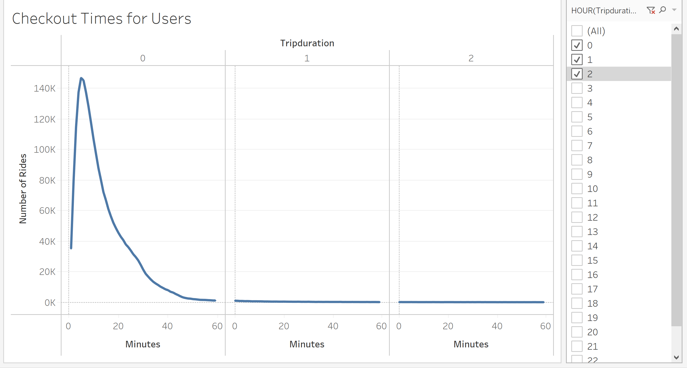
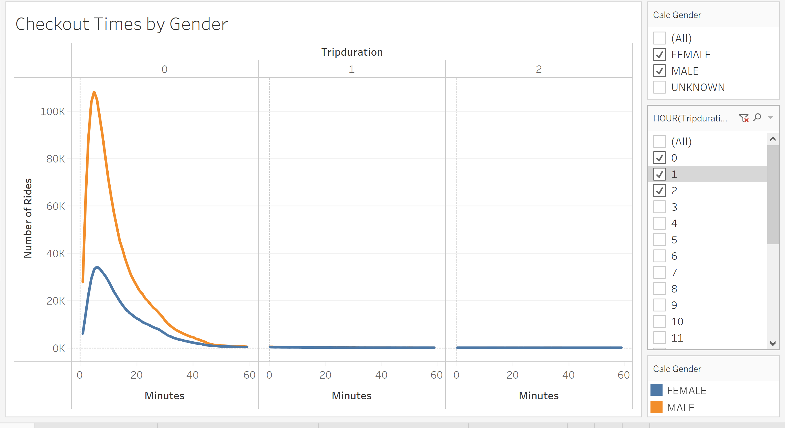
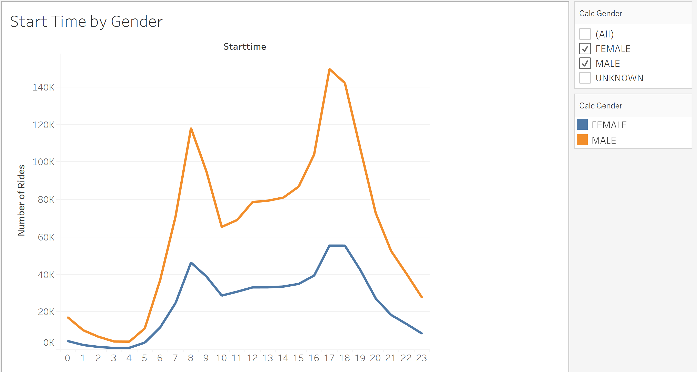
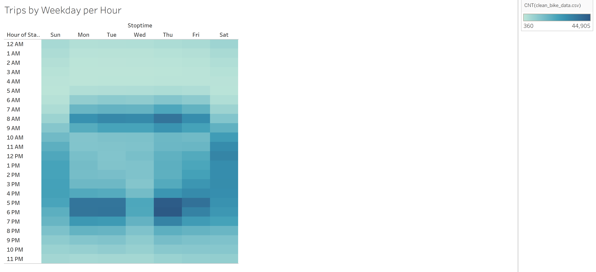
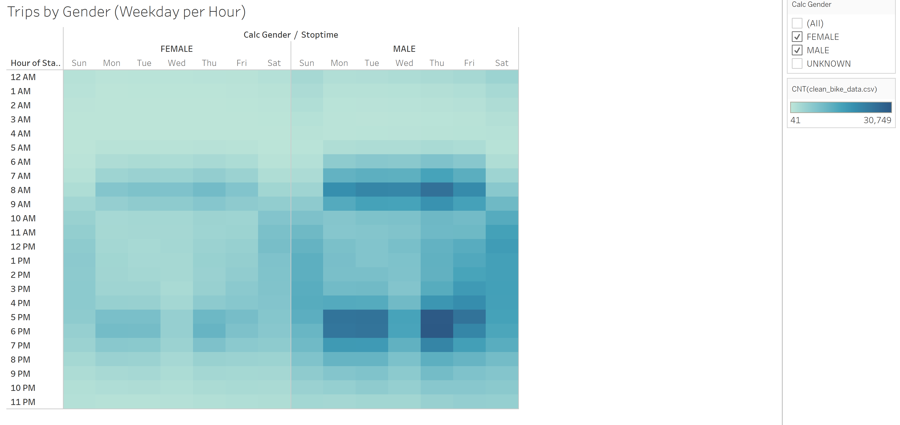
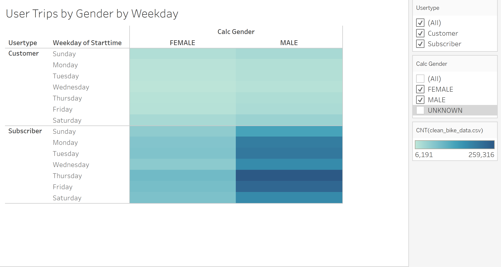
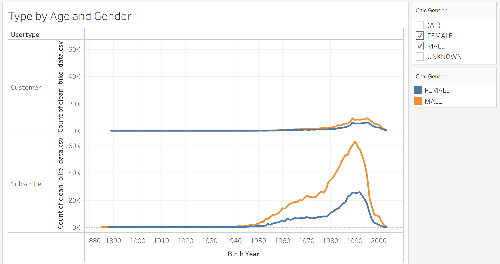

# bikesharing

## Overview
The purpose of this project was to use Tableau to visualize Citi bikesharing data with the intention of presenting to investors.

## Results

The vast majority of rides were used for about 5 minutes

Trip duration was about the same for male and female riders, but there are far more male riders

Start times were about the same across genders, peaking around both 8am and 5pm

During the week the bike usage correlates with standard working hours, and on the weekend usage is more evenly distributed.

Usage times were about the same for male and female riders, but there are far more male riders

For both geners, the majority of customers were born around 1990. The number of users of the "customer" type were very close between genders, but there were far more males that subscribed to the service.

Usage by day of week is about the same across each gender and user type.

## Summary
The data shows that males use the service far more than females, and appear more likely to subscribe. Usage across genders peaks around 8am and 5pm througout the work week, and is spread more evenly througout the day during the weekend. I would recommend another visualization showing the most popular start and end stops across both genders and customer types, to see if specific locations stand out.

[link to dashboard](https://public.tableau.com/app/profile/lorenzo.m.gutierrez/viz/CitiBikeAnalysisLG/CitiBikeAnalysis)
